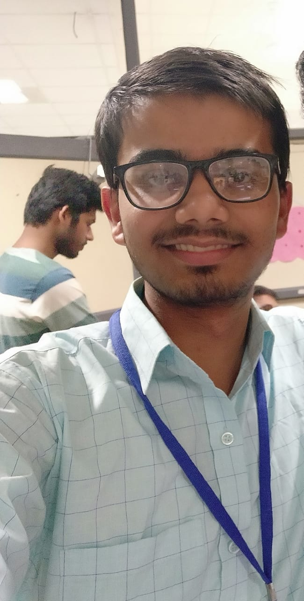

# Objecto

<h3><I>The Open-source android app that uses ResNet Deep Learning Model (using PyTorch as backend FrameWork)</I></h3>

<video width="300" height="450" src="images/objecto.mp4" type="video/mp4" controls>
</video>

  <h2><U><B>Dependencies</B></U></h2>
<h4>1. Python 3 </h4>
    Visit https://www.python.org/
<h4>2. PyTorch 1.4.0</h4>  
    Visit https://pytorch.org/
<h4>3. Android-Studio</h4>
    Visit https://developer.android.com/studio

<h3>App currently supports:</h3> 
    Max SDK Version 27 (Android 8.1 Oreo)
    Min SDK Version 21 (Android 5.0 Lollipop)
    
<h2>Support for these versions will be provided in near future !</h2>

    
Here is what this app can detect !!!

<h4>Made by <B>Anshuman Mishra</B></h4>

